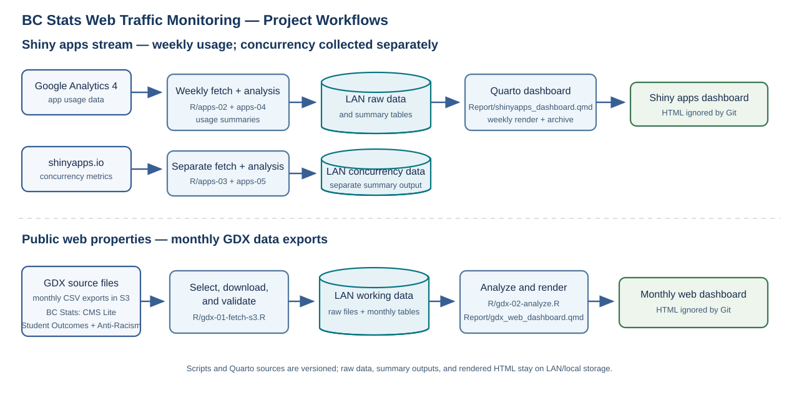

# BC Stats Web Traffic Monitoring

This repository monitors web traffic across two reporting families:

1. Shiny app usage and concurrency metrics
2. Public web property traffic for BC Stats (CMS Lite) and Student Outcomes and Anti-Racism Data Act (WordPress)

The repository is intentionally organized around source code, reports, and local-only generated outputs. Raw data, derived tables, and rendered reports are kept outside the Git repository on secure LAN/local storage whenever possible.

## Project purpose

The project pulls web traffic data from multiple sources and produces summary tables and Quarto dashboards that support operational reporting.

### Project workflow

The repository contains two independent reporting pipelines: weekly monitoring of Shiny apps and monthly reporting for the public web properties. Both use source scripts and Quarto reports in Git, while raw data and generated outputs are stored on configured LAN paths rather than committed.



### Shiny apps stream

The Shiny dashboards pipeline downloads Google Analytics 4 data and shinyapps.io metrics, summarizes usage patterns, and renders a dashboard for the maintained apps.

Dashboards currently tracked:

- LAEP
- Student Outcomes
- popApp
- BC Small Business
- LFS app
- Economic-Indicators
- BCDS-DIP Linkage Rates
- Household Projections
- Country Trade Profiles
- Interprovincial Migration
- BC Retail Sales

Main scripts:

- `R/00-setup.R` — package setup, GA/shinyapps auth, LAN path configuration
- `R/apps-01-fetch-ga-history.R` — historical GA4 pull
- `R/apps-02-fetch-ga-weekly.R` — incremental GA4 refresh
- `R/apps-03-fetch-shinyapps.R` — shinyapps.io metrics pull
- `R/apps-04-analyze-usage.R` — app usage summaries
- `R/apps-05-analyze-concurrency.R` — app concurrency summaries
- `R/apps-06-executive-summary.R` — summary tables and visuals
- `R/apps-run-weekly-pipeline.R` — end-to-end weekly Shiny dashboard pipeline
- `Report/shinyapps_dashboard.qmd` — Quarto dashboard for app usage metrics

### BC Stats public web traffic stream

This stream covers the web traffic reporting for:

- BC Stats (Statistics and Surveys)
- Student Outcomes
- Anti-Racism Data Act

The GDX source data is delivered as monthly data exports and is used to validate the reporting month, summarize traffic, and render a dashboard for these web properties.

Main scripts:

- `R/gdx-run-monthly-pipeline.R` — master monthly pipeline for the BC Stats public web dashboard
- `R/gdx-01-fetch-s3.R` — downloads the selected source-data CSV files from S3
- `R/gdx-02-analyze.R` — builds the monthly summary tables for the dashboard
- `R/gdx-03-analyze-bcdc.R` — BCDC-focused analysis and dataset rankings
- `R/functions/month-run-helpers.R` — shared month and validation helpers
- `R/functions/gdx-web-analysis-functions.R` — analysis logic for the public web traffic datasets
- `Report/gdx_web_dashboard.qmd` — dashboard for the BC Stats public web properties

The GDX data package includes, for each site:

- daily page view counts by URL
- daily click counts by target URL
- daily referring URL counts by site
- daily platform counts by site
- daily counts by province and country by site

For the BC Stats property specifically, the package also includes:

- daily asset download counts by asset URL
- monthly site search terms
- monthly Google search terms, including click count and impression count

## Repository layout

```text
.
├── R/
│   ├── 00-setup.R
│   ├── apps-01-fetch-ga-history.R
│   ├── apps-02-fetch-ga-weekly.R
│   ├── apps-03-fetch-shinyapps.R
│   ├── apps-04-analyze-usage.R
│   ├── apps-05-analyze-concurrency.R
│   ├── apps-06-executive-summary.R
│   ├── apps-run-weekly-pipeline.R
│   ├── gdx-01-fetch-s3.R
│   ├── gdx-02-analyze.R
│   ├── gdx-03-analyze-bcdc.R
│   ├── gdx-run-monthly-pipeline.R
│   └── functions/
│       ├── gdx-web-analysis-functions.R
│       └── month-run-helpers.R
├── Report/
│   ├── shinyapps_dashboard.qmd
│   └── gdx_web_dashboard.qmd
├── docs/
│   └── (runbooks, notes, and supporting project documentation)
├── README.md
├── .gitignore
├── .Renviron.example
├── LICENSE
├── CODE_OF_CONDUCT.md
├── CONTRIBUTING.md
└── .Rprofile (if present locally)
```

## Local-only data and secrets

The repository stores source code, not the actual working data or credentials.

Local-only files should remain outside the Git-tracked repo or be ignored by Git. In practice:

- credentials live in `.Renviron` or another local secret file
- the GA service account JSON file is not committed
- raw data and generated tables live in LAN/local storage or local output folders
- rendered HTML dashboards are treated as disposable local outputs unless intentionally versioned

## Required local configuration

A template is included in `.Renviron.example`.

Copy it to `.Renviron` and populate the values needed for your environment.

### Required variables

```text
GA_SERVICE_EMAIL
GA_SERVICE_KEY
SHINY_ACC_NAME
SHINY_TOKEN
SHINY_SECRET
AWS_ACCESS_KEY_ID
AWS_SECRET_ACCESS_KEY
AWS_DEFAULT_REGION
BCSTATS_S3_BUCKET
BCSTATS_S3_PREFIX
SAFEPATHS_NETWORK_PATH
```

### Optional variables

```text
GA_PROPERTY_ID
GA_DATE_START
GA_DATE_END
EXTRA_RENVIRON_PATH
GDX_TARGET_MONTH
BCSTATS_S3_SOURCE_SUBFOLDER
BCSTATS_S3_KEY_PATTERN
GDX_USE_EXPLICIT_S3_SELECTION
GDX_DASHBOARD_MAX_MONTH
```

## How to use this repo

### Shiny apps stream

Use the Shiny apps pipeline when you want to refresh the GA4 and shinyapps.io usage reporting for the maintained apps.

Run the workflow in sequence:

```r
source("R/apps-01-fetch-ga-history.R")
source("R/apps-03-fetch-shinyapps.R")
source("R/apps-04-analyze-usage.R")
source("R/apps-05-analyze-concurrency.R")
source("R/apps-06-executive-summary.R")
source("R/apps-run-weekly-pipeline.R")
```

The master script handles the weekly refresh and renders the dashboard for the app reporting stream.

```r
quarto::quarto_render("Report/shinyapps_dashboard.qmd")
```

### BC Stats public web traffic stream

Use this workflow when you want to refresh the public web traffic dashboard for:

- BC Stats (Statistics and Surveys)
- Student Outcomes
- Anti-Racism Data Act

Run the monthly pipeline:

```r
source("R/gdx-run-monthly-pipeline.R")
```

This script:

1. resolves the target reporting month
2. selects the correct source-data files from S3
3. downloads the monthly data exports
4. validates the report families and month
5. writes the monthly output tables
6. renders `Report/gdx_web_dashboard.qmd`

This is the correct path for the public web traffic dashboard, not the Shiny app workflow.

## Documentation and runbooks

Use `docs/` for operational notes, runbooks, and explanation of data-source assumptions. Keep the project narrative in the README and keep implementation details in the scripts and runbooks.

## Contributing

- keep the source code in `R/`
- keep report definitions in `Report/`
- keep generated files in `outputs/` or local secure storage, not in the tracked repo by default
- never commit local credentials or auth material
- keep changes small and explicit so it is easy to trace pipeline updates

## Notes

- This repository stores code, not production data.
- Data access depends on local credentials and secure paths.
- The scripts are intentionally the source of truth for the analyses; documentation should explain how to run them, not duplicate their logic.
